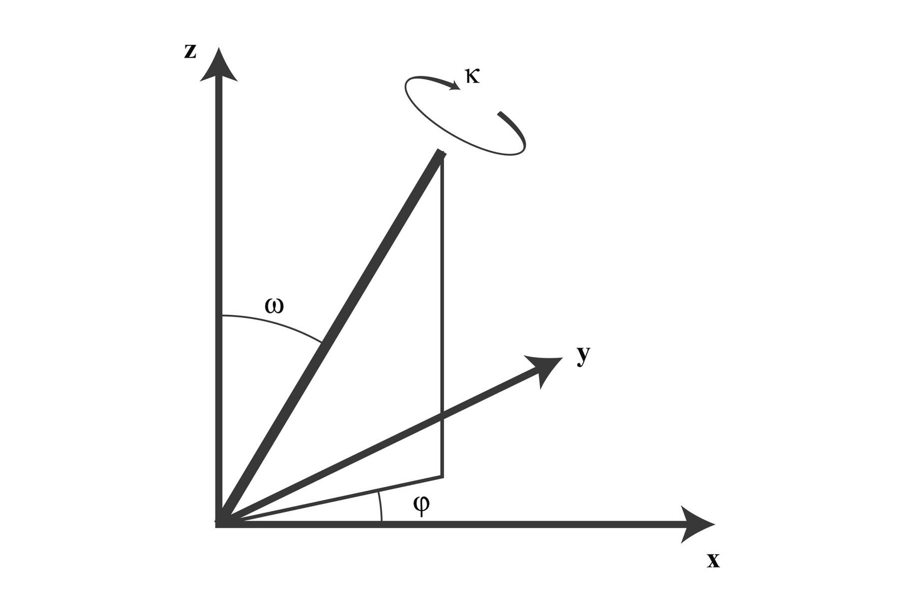

.. _calc_surface_energy:

============================
Calculating Surface Energies
============================

Notation
--------
Vectors and planes in a crystal lattice are described by three-value Miller index notation.  It uses
the indices :math:`h`, :math:`l`, and :math:`k` as direction parameters.  By definition, the notation :math:`(hlk)`
denotes a plane which intercepts three points: :math:`a_1/h`, :math:`a_2/l`, and :math:`a_3/k`.

A more convenient definition of the :math:`(hlk)` family of the planes are the planes orthogonal to the vector :math:`[h,l,k]`.

* Coordinates in angle brackets such as :math:`\langle 100 \rangle` denote a family of directions that are equivalent due to symmetry operations, such as :math:`[100]`, :math:`[010]`, :math:`[001]` or the negative of any of those directions.

* Coordinates in curly brackets or braces such as :math:`\langle 100 \rangle` denote a family of plane normals that are equivalent due to symmetry operations, much the way angle brackets denote a family of directions.

Creating the Structures
=======================

The process for creating slab surfaces has been described in literature.

* :cite:`trans2016_surface` Tran.

The strategy to create a surface, it is desirable to have it defined in a orthorhombic simulation (or near orthorhombic simulation cell), with family of planes we are interested in be perpendicular to the z-axis.

To do this we transform the a unit vector in the :math:`[h,l,k]` direction into a vector in the :math:`[0,0,1]` direction.

.. math::

   \begin{bmatrix} h \\ l \\ k \end{bmatrix}
   \begin{bmatrix} p_{11} & p_{12} & p_{13} \\ p_{21} & p_{22} & p_{23} \\ p_{31} & p_{32} & p_{33} \end{bmatrix}
   =
   \begin{bmatrix} 0 \\ 0 \\ 1  \end{bmatrix} 

In order to create a surface, it is desireable to have it defined in a orthorhombic simulation cell, with the desired orientation of the surface in the :math:`[0,0,1]` direction.  I need to find the basis vectors and also the number of basic vector for the interface to be along (110) or (111) plane and the unit cell which I again guess will be cubic. Then I need to repeat these basis vectors along all three axis to generate the crystal with the required orientation.  Given the linear transformation matrix :math:`\mathbf{M}` and the translation vector :math:`\mathbf{t}`.  The new position of a particle will be

.. math::

   x^\prime = \mathbf{M} \mathbf{x} + \mathbf{t} 

Rotation Matrices
-----------------

There are two types of rotational matrices, one which covers polar angle transformation and one that covers Euler angle transformation.

Typically, discussions of transformation matrices are covered under an Euler angle transformation.

Let us define the Euler Angle transformation matrices,

:math:`\mathbf{R}
The mathematics of rotation matrices are covered in :cite:`evans2001rotations`.

   Polar coordinate representation, image from :cite:`evans2001rotations`.

We know that the :math:`[111]` vector

Suppose we have the original basis vectors :math:`\mathbf{a}_1`, :math:`\mathbf{a}_2`, and :math:`\mathbf{a}_3`,
The new basis vectors :math:`\mathbf{a}_1^\prime`, :math:`\mathbf{a}_2^\prime`, and :math:`\mathbf{a}_2\prime`.  The the rotation matrix :math:`\mathbf{P}` is related to these quantities

.. math::

   \begin{bmatrix} \mathbf{a}_1^\prime & \mathbf{a}_2^\prime & \mathbf{a}_3^\prime \end{bmatrix} =
   \begin{bmatrix} \mathbf{a}_1 & \mathbf{a}_2 & \mathbf{a}_3 \end{bmatrix}
   \begin{bmatrix} p_{11} & p_{12} & p_{13} \\ p_{21} & p_{22} & p_{23} \\ p_{31} & p_{32} & p_{33} \end{bmatrix}

`Emre Tasci.  How to Prepare an Input File for Surface Calculations. <https://www.researchgate.net/file.PostFileLoader.html?id=560d40475e9d97f2d68b4600&assetKey=AS%3A279749973823490%401443708999090>`_
`Using VESTA to make a surface. <https://compuphys.wordpress.com/2015/02/10/surface-slabs-mit-vesta/>`_

Calculation of Suface Energies
==============================

Convergence of Surface Energy Calculations
==========================================
* The creation and convergence of surface slabs.:cite:`sun2013_surface_slabs`

* :cite:`wan1999surface`.  Modelling of surface relaxation and stress in fcc metals.
* `Surface Calculation example in DFT.<http://exciting-code.org/lithium-surface-calculations#toc17>`.  I really like the format of this presentation.  I will use this format in both preparing a DFT exercise, creating a slab convergence workflow, and elucidating the points below.

Converging the width of the slab
--------------------------------

Converging the amount of the vacuum
-----------------------------------

Converging the kpoint-mesh
--------------------------
`Partial dislocations in FCC crystals <http://people.virginia.edu/~lz2n/mse6020/notes/D-partial-fcc.pdf>`_

References
==========
.. bibliography:: calc_surface_energy.bib
