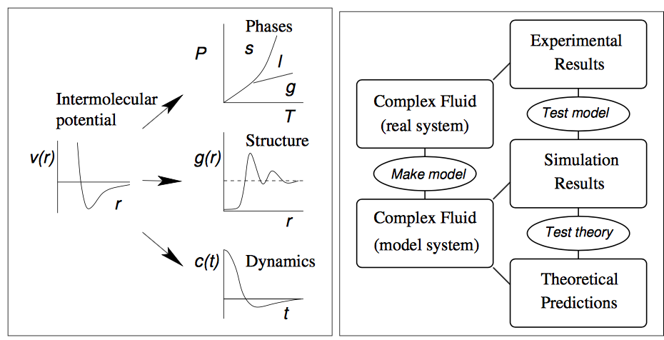

.. _intro_md:

==================================
Introduction to Molecular Dynamics
==================================

Molecular dynamics gives a route to dynamical properties of a system: transport coefficients, time-dependent reponses to perturbations, rheological properties, and
spectra.  Computer simulation serves as a bridge between the microscopic and and macroscopic; theory and experiment.

   
   Bridge between theory and experiment.

Atomic interactions
-------------------

Molecular dynamics simulation consists of a step-by-step numerical solution of the classical equations of motion

.. math::

   m_i \frac{\partial^2 \mathbf{r}}{\partial t^2}  = \mathbf{f}_i

.. math::

   \mathbf{f}_i = - \frac{\partial}{\partial \mathbf{r}_i} \mathcal{U}

Typically :math:`\mathcal{U}` is an empirical atomic potential, although these Energies can be calculated using ab initio techniques such as density functional theory (DFT).
Time integration
----------------

Periodic boundary conditions
----------------------------
Small sample sizes means that unless surface effects are of a particular interest, periodic boundary conditions are necessary.
If we consider a system with 1000 atoms arranged in a 10x10x10 cube, nearly half the atoms are on the outer faces, and these surfaces will have a large effect on the measured properties.
Surrounding the cube with replicas of itself takes care of this problem.  Provided the potential range is not too long, we can adopt the minimum image convention that each atom interacts with the nearest atom or image in the periodic array.

Neighbor lists
--------------

 
